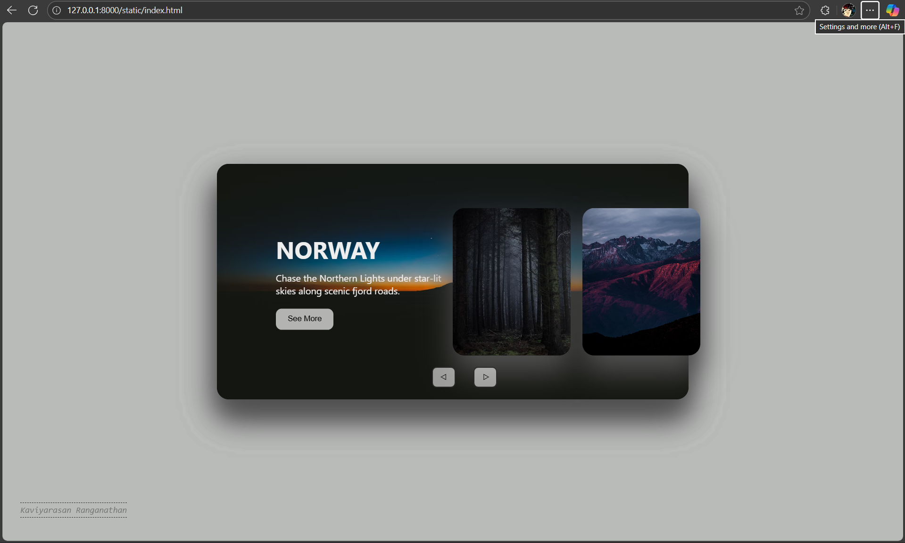
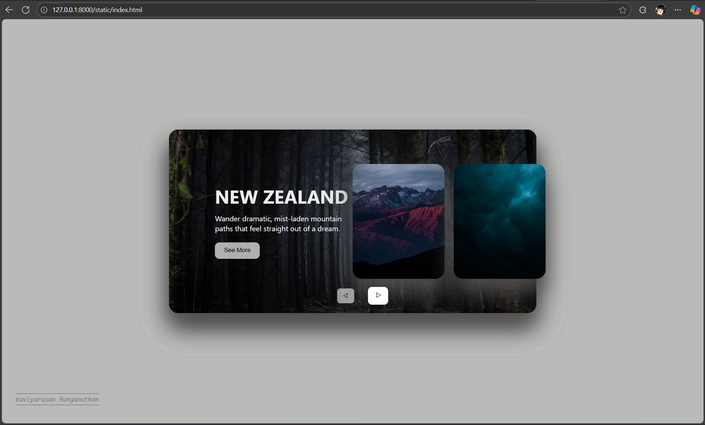
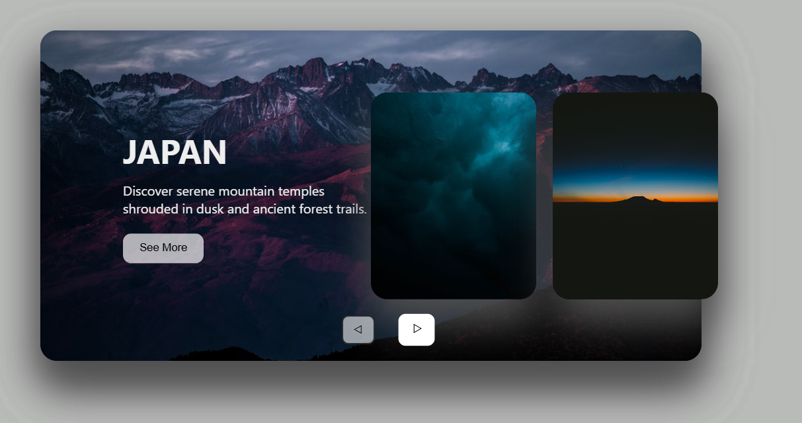
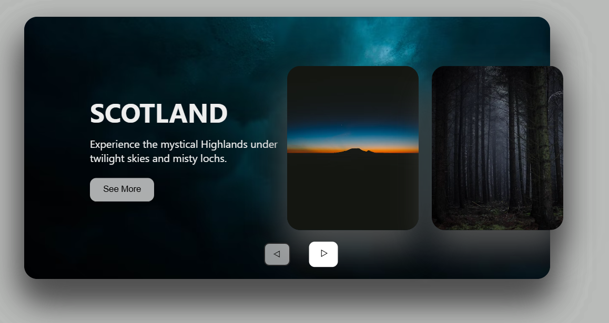

# Ex.08 Design of Interactive Image Gallery

## Date:01-11-2025

## AIM:

To design a web application for an inteactive image gallery for a minimum five images with next and previous buttons.

## DESIGN STEPS:

### Step 1:

Clone the github repository and create Django admin interface.

### Step 2:

Change settings.py file to allow request from all hosts.

### Step 3:

Use CSS for positioning and styling.

### Step 4:

Write JavaScript program for implementing interactivity.

### Step 5:

Validate the HTML and CSS code.

### Step 6:

Publish the website in the given URL.

## PROGRAM:

index.html

```html
<!DOCTYPE html>
<html lang="en">
  <head>
    <meta charset="UTF-8" />
    <title>Animated image slider | HTML, CSS & JavaScript</title>
    <link rel="stylesheet" href="./style.css" />
  </head>

  <body>
    <body>
      <div class="container">
        <div class="slide">
          <div
            class="item"
            style="
              background-image: url('https://images.unsplash.com/photo-1478760329108-5c3ed9d495a0?q=80&w=1074&auto=format&fit=crop&ixlib=rb-4.1.0&ixid=M3wxMjA3fDB8MHxwaG90by1wYWdlfHx8fGVufDB8fHx8fA%3D%3D');
            "
          >
            <div class="content">
              <div class="name">Scotland</div>
              <div class="des">
                Experience the mystical Highlands under twilight skies and misty
                lochs.
              </div>
              <a
                class="seeMore"
                target="_blank"
                href="https://github.com/MDJAmin"
                ><button>See More</button></a
              >
            </div>
          </div>

          <div
            class="item"
            style="
              background-image: url('https://images.unsplash.com/photo-1439792675105-701e6a4ab6f0?q=80&w=1173&auto=format&fit=crop&ixlib=rb-4.1.0&ixid=M3wxMjA3fDB8MHxwaG90by1wYWdlfHx8fGVufDB8fHx8fA%3D%3D');
            "
          >
            <div class="content">
              <div class="name">Norway</div>
              <div class="des">
                Chase the Northern Lights under star-lit skies along scenic
                fjord roads.
              </div>
              <a
                class="seeMore"
                target="_blank"
                href="https://github.com/MDJAmin"
                ><button>See More</button></a
              >
            </div>
          </div>

          <div
            class="item"
            style="
              background-image: url('https://images.unsplash.com/photo-1483982258113-b72862e6cff6?q=80&w=1170&auto=format&fit=crop&ixlib=rb-4.1.0&ixid=M3wxMjA3fDB8MHxwaG90by1wYWdlfHx8fGVufDB8fHx8fA%3D%3D');
            "
          >
            <div class="content">
              <div class="name">New Zealand</div>
              <div class="des">
                Wander dramatic, mist-laden mountain paths that feel straight
                out of a dream.
              </div>
              <a
                class="seeMore"
                target="_blank"
                href="https://github.com/MDJAmin"
                ><button>See More</button></a
              >
            </div>
          </div>

          <div
            class="item"
            style="
              background-image: url('https://images.unsplash.com/photo-1477346611705-65d1883cee1e?q=80&w=2070&auto=format&fit=crop&ixlib=rb-4.1.0&ixid=M3wxMjA3fDB8MHxwaG90by1wYWdlfHx8fGVufDB8fHx8fA%3D%3D');
            "
          >
            <div class="content">
              <div class="name">Japan</div>
              <div class="des">
                Discover serene mountain temples shrouded in dusk and ancient
                forest trails.
              </div>
              <a
                class="seeMore"
                target="_blank"
                href="https://github.com/MDJAmin"
                ><button>See More</button></a
              >
            </div>
          </div>
        </div>
        <div class="button">
          <button class="prev">◁</button>
          <button class="next">▷</button>
        </div>
      </div>
      <div class="MDJAminDiv">
        <a
          class="MDJAmin"
          href="https://github.com/kaviarasan01/igallery"
          target="_blank"
          >Kaviyarasan Ranganathan</a
        >
      </div>
      <script src="js/script.js"></script>
    </body>
    <script src="./script.js"></script>
  </body>
</html>
```

script.js

```javascript
"use strict";

let next = document.querySelector(".next");
let prev = document.querySelector(".prev");

next.addEventListener("click", function () {
  let items = document.querySelectorAll(".item");
  document.querySelector(".slide").appendChild(items[0]);
});

prev.addEventListener("click", function () {
  let items = document.querySelectorAll(".item");
  document.querySelector(".slide").prepend(items[items.length - 1]);
});
```

style.css

```css
* {
  margin: 0;
  padding: 0;
  box-sizing: border-box;
}

body {
  background: #b9bbb9;
  overflow: hidden;
}

.container {
  position: absolute;
  top: 50%;
  left: 50%;
  transform: translate(-50%, -50%);
  width: 800px;
  height: 400px;
  background: #f5f5f5;
  box-shadow: 0 30px 50px #dbdbdb;
  border-radius: 20px;
}
.container .slide {
  border-radius: 20px;
}
.container .slide .item {
  width: 200px;
  height: 250px;
  position: absolute;
  top: 50%;
  transform: translate(0, -50%);
  border-radius: 20px;
  box-shadow: 0 30px 50px #505050;
  background-position: 50% 50%;
  background-size: cover;
  display: inline-block;
  transition: all 0.5s;
}

.slide .item:nth-child(1),
.slide .item:nth-child(2) {
  top: 0;
  left: 0;
  transform: translate(0, 0);
  border-radius: 0;
  width: 100%;
  height: 100%;
  border-radius: 20px;
  transition: all 0.5s;
}

.slide .item:nth-child(3) {
  left: 50%;
}
.slide .item:nth-child(4) {
  left: calc(50% + 220px);
}
.slide .item:nth-child(5) {
  left: calc(50% + 440px);
}

.slide .item:nth-child(n + 6) {
  left: calc(50% + 660px);
  opacity: 0;
}
.item .content {
  position: absolute;
  top: 50%;
  left: 100px;
  width: 300px;
  text-align: left;
  color: #eee;
  transform: translate(0, -50%);
  font-family: system-ui;
  display: none;
}

.slide .item:nth-child(2) .content {
  display: block;
}

.content .name {
  font-size: 40px;
  text-transform: uppercase;
  font-weight: bold;
  opacity: 0;
  animation: animate 1s ease-in-out 1 forwards;
}

.content .des {
  margin-top: 10px;
  margin-bottom: 20px;
  opacity: 0;
  animation: animate 1s ease-in-out 0.3s 1 forwards;
}

.content button {
  padding: 10px 20px;
  border: none;
  cursor: pointer;
  opacity: 0;
  border-radius: 10px;
  background-color: rgba(255, 255, 255, 0.673);
  transition: all 0.5s;
  animation: animate 1s ease-in-out 0.6s 1 forwards;
}

.content button:hover {
  background-color: rgb(255, 255, 255);
}

@keyframes animate {
  from {
    opacity: 0;
    transform: translate(0, 100px);
    filter: blur(33px);
  }

  to {
    opacity: 1;
    transform: translate(0);
    filter: blur(0);
  }
}

.button {
  display: flex;
  flex-direction: row;
  gap: 20px;
  left: 45%;
  right: 50%;
  width: 100%;
  align-items: center;
  text-align: center;
  position: absolute;
  bottom: 20px;
}

.button button {
  width: 40px;
  height: 35px;
  border-radius: 8px;
  border: none;
  cursor: pointer;
  margin: 0 5px;
  border: 2px solid #000000bd;
  transition: 0.3s;
  background: rgba(255, 255, 255, 0.578);
}

.button button:hover {
  color: #000000;
  border: 2px solid #ffffffbd;
  transform: scale(1.1);
}
.button button:focus {
  transform: scale(1.1);
  background: #ffffff;
  border: 2px solid #ffffffbd;
}
.button button:active {
  transform: scale(1.02);
}
.next {
  padding: 0 0 0 3px;
}
.prev {
  padding: 0 3px 0 0;
}

.MDJAminDiv {
  z-index: 4444;
  position: fixed;
  bottom: 5%;
  left: 2%;
}

.MDJAmin {
  text-decoration: none;
  border-bottom: 1px dashed rgb(44, 44, 44);
  border-top: 1px dashed rgb(44, 44, 44);
  padding: 4px 0;
  color: rgba(44, 44, 44, 0.525);

  font-family: monospace;
  font-style: italic;
  font-size: 1.1em;
  transition: all 0.5s;
}

.MDJAmin:hover {
  color: #000000;
}
```

## OUTPUT:









## RESULT:

The program for designing an interactive image gallery using HTML, CSS and JavaScript is executed successfully.
